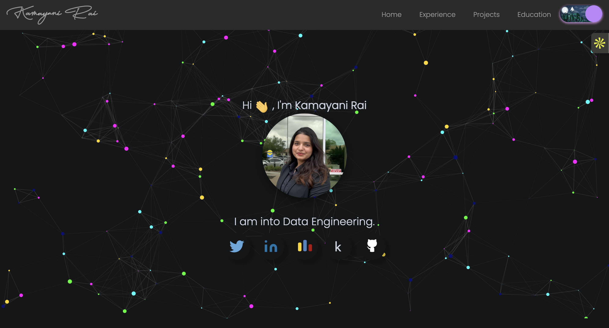

## Portfolio

Visit my [Portfolio Website](https://kamayanirportfolio.netlify.app) or [here](https://kamayanir.github.io/Portfolio/)

## Home Page:

## Education Page:

 

## Project Page:

This portfolio is based on a fork of this repository [here](https://github.com/smaranjitghose/awesome-portfolio-websites) , with necessary customizations and modifications made to suit 
 my personal use.  

